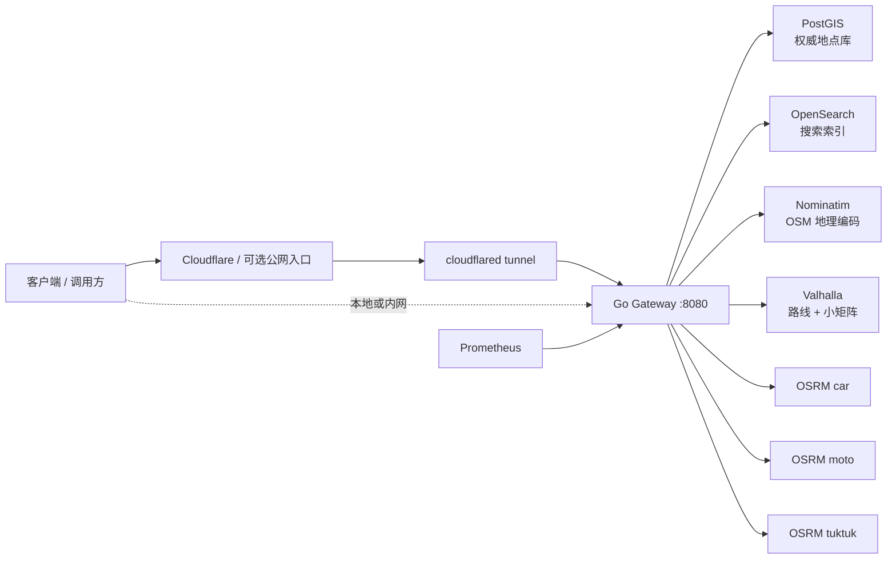
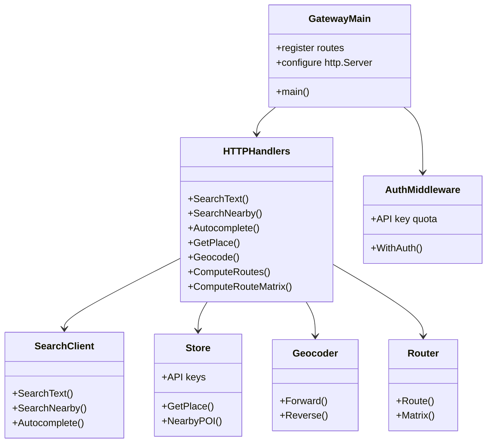
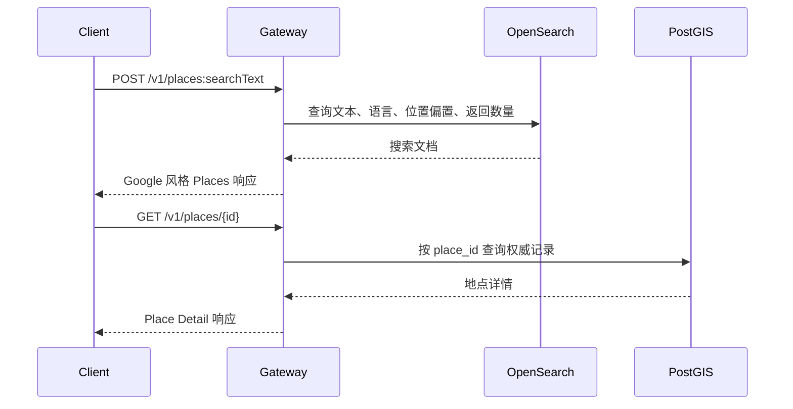
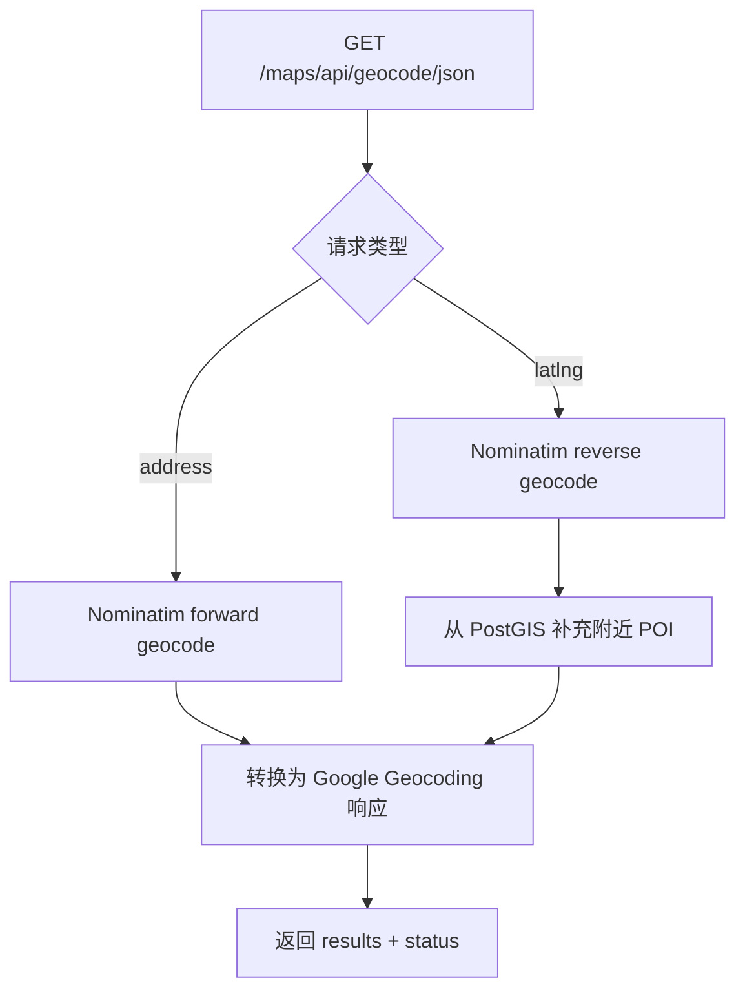
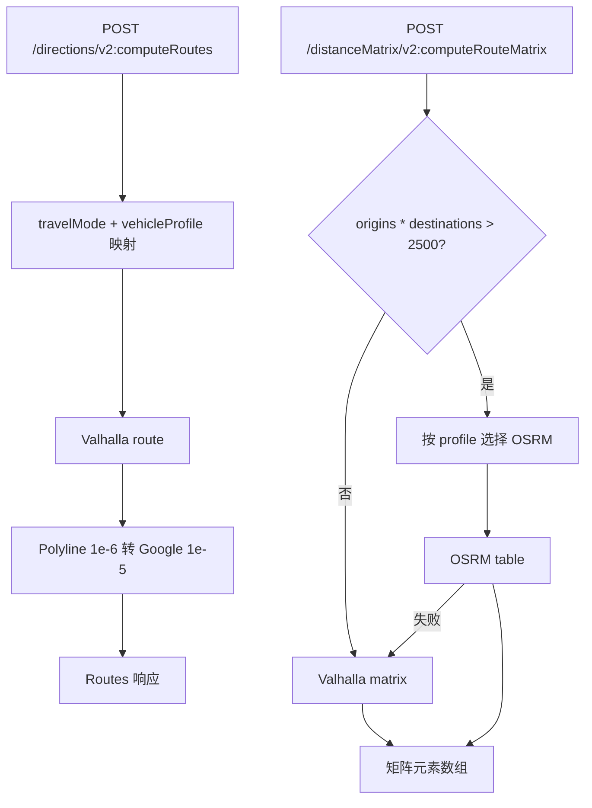
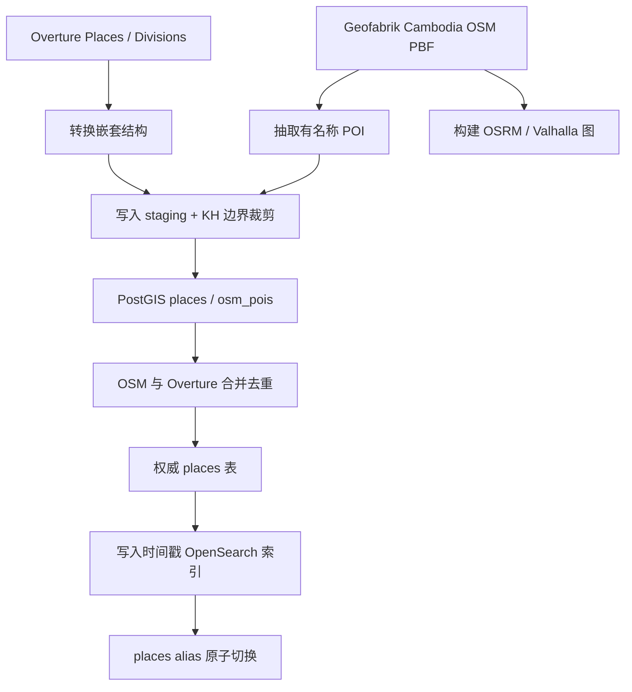
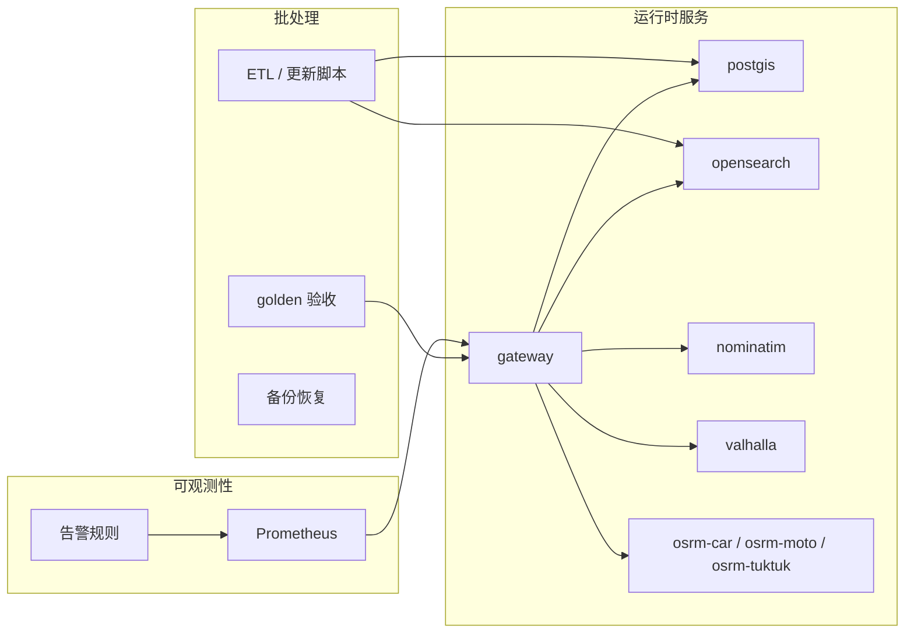

# 架构文档

open-map-service 是一个面向柬埔寨区域的自托管地图 API 服务。它对外暴露 Google 风格的 Places、Geocoding、Routes 和 Distance Matrix API，对内组合 PostGIS、OpenSearch、Nominatim、Valhalla 和 OSRM。

## 设计目标

- 提供可自托管、可复现的地点搜索、地理编码、路线规划和距离矩阵能力。
- 尽量兼容 Google API 的请求/响应形态，降低客户端迁移成本。
- 支持 Khmer、English、Chinese 等多语言名称，具体覆盖度取决于源数据。
- 支持柬埔寨本地交通形态，包括驾车、摩托、步行和嘟嘟车。
- 数据处理、索引构建、路由图构建都可以通过脚本重复执行。

## 系统上下文

Gateway 是唯一需要对外暴露的应用服务。PostGIS、OpenSearch、Nominatim、Valhalla 和 OSRM 都是内部依赖。

## 运行时组件

| 组件 | 职责 | 主要位置 |
| --- | --- | --- |
| Gateway | HTTP API、Google 风格协议适配、鉴权、指标、后端编排 | `gateway/cmd/gateway/main.go`、`gateway/internal/httpapi` |
| PostGIS | 权威地点数据、API Key、边界和 staging 表 | `db/migrations`、`gateway/internal/store` |
| OpenSearch | 文本搜索、自动补全、附近搜索 | `etl/etl/index.py`、`gateway/internal/search` |
| Nominatim | OSM 地址正向/逆向地理编码 | `gateway/internal/geocode` |
| Valhalla | 路线规划、小矩阵、OSRM 降级路径 | `gateway/internal/route/valhalla.go` |
| OSRM | 大矩阵计算，分 car、moto、tuktuk 三套图 | `gateway/internal/route/osrm.go`、`profiles/` |
| Prometheus | 指标采集和告警规则评估 | `deploy/prometheus` |

## Gateway 路由

| 方法 | 路径 | 说明 |
| --- | --- | --- |
| `POST` | `/v1/places:searchText` | 文本地点搜索 |
| `POST` | `/v1/places:searchNearby` | 附近地点搜索 |
| `POST` | `/v1/places:autocomplete` | 地点自动补全 |
| `GET` | `/v1/places/{id}` | 地点详情 |
| `GET` | `/maps/api/geocode/json` | 地址正向/逆向地理编码 |
| `POST` | `/directions/v2:computeRoutes` | 路线规划 |
| `POST` | `/distanceMatrix/v2:computeRouteMatrix` | 距离矩阵 |
| `GET` | `/healthz` | 存活检查 |
| `GET` | `/metrics` | Prometheus 指标 |

所有 API 请求都会经过 request id、Prometheus metrics 和可选 API Key 鉴权中间件。鉴权由 `AUTH_ENABLED=true` 开启，默认关闭。

## Gateway 模块关系

## 地点搜索链路

OpenSearch 用于发现和排序，PostGIS 是详情接口的数据源。搜索结果中的 PostGIS/OpenSearch `place_id` 可以用于 `/v1/places/{id}`，但 Nominatim 返回的 `nominatim:way:123` 这类 ID 不能用于地点详情接口。

## 地理编码链路

正向和逆向地理编码主要依赖 Nominatim。逆向地理编码会额外尝试从 PostGIS 查询附近 POI，用于增强结果。

## 路线与矩阵链路

Valhalla 是路线规划和小矩阵的默认引擎。OSRM 用于大矩阵，因为 table 计算更快。OSRM 不可用时，矩阵请求会降级到 Valhalla。

## 数据流

完整数据管道由 `make etl-all` 和 `scripts/update_pipeline.sh` 承载。详细说明见 [数据管道](data-pipeline.md)。

## 部署拓扑

Docker Compose 是本地和单机参考部署。Kubernetes manifests 位于 `deploy/k8s`。

## 可靠性设计

- OpenSearch 采用时间戳索引 + alias 原子切换，降低重建索引时的中断风险。
- 数据更新脚本有行数漂移闸，避免上游数据异常静默污染生产索引。
- 大矩阵优先 OSRM，失败后降级 Valhalla。
- Gateway `WriteTimeout` 为 120 秒，给大矩阵响应留出时间。
- OSRM 图文件不能在线覆盖，更新脚本会先停止 OSRM，再重建图。
- `/metrics` 暴露 Prometheus 指标，告警规则位于 `deploy/prometheus/rules.yml`。

## 代码结构入口

更多目录说明见 [代码结构](repository-map.md)。
