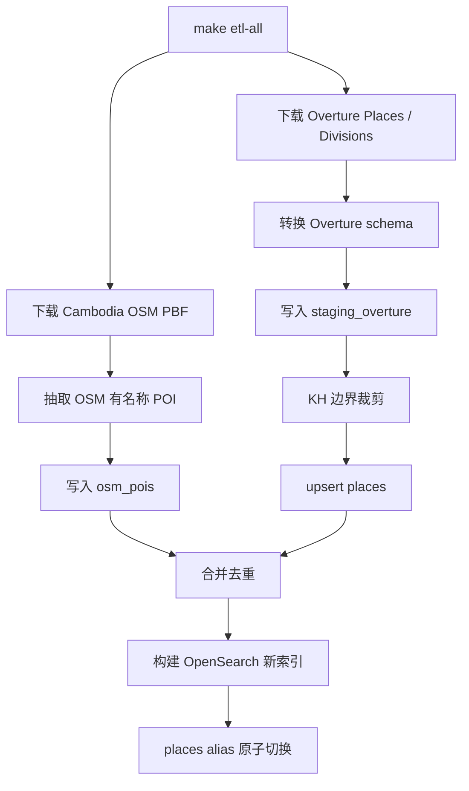
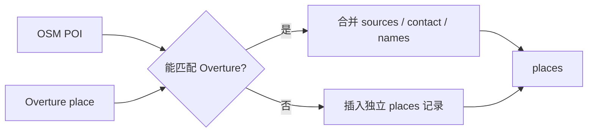
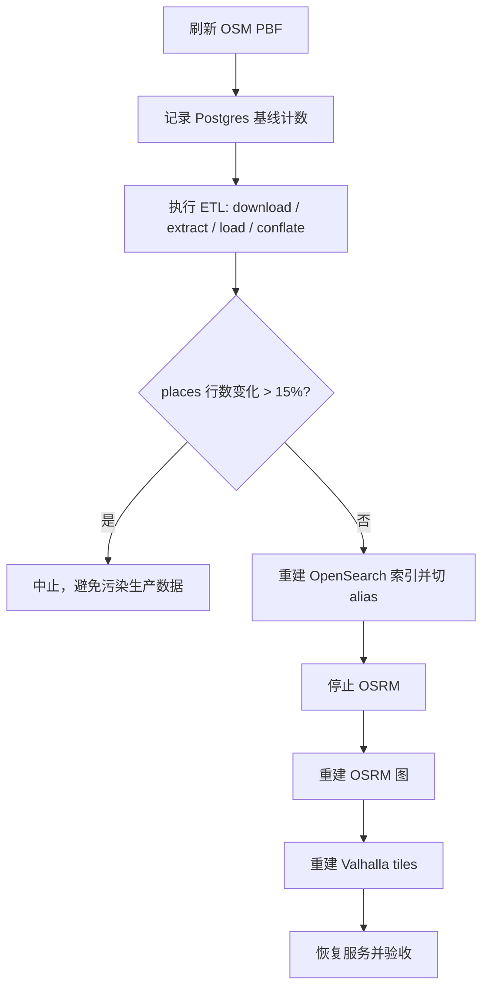

# 数据管道

open-map-service 的数据由 Overture Maps 和 OpenStreetMap 共同构成。PostGIS 保存权威地点记录，OpenSearch 保存搜索索引，OSRM 和 Valhalla 使用 OSM PBF 构建路由图。

## 数据来源

| 来源 | 用途 |
| --- | --- |
| Overture Places | 主要 POI 数据源 |
| Overture Divisions | 柬埔寨边界，用于裁剪 bbox 结果 |
| Geofabrik Cambodia OSM PBF | OSM POI、Nominatim、OSRM、Valhalla |

## 总体流程



## 本地完整管道

```bash
make py-setup
make etl-osm
make migrate
make etl-all
```

`make etl-all` 会执行：

1. `etl-overture`
2. `etl-osm`
3. `etl-load`
4. `etl-conflate`
5. `etl-index`

## Overture 转换

入口：

```text
etl/etl/overture.py
```

输出：

```text
data/overture_places_raw.parquet
data/overture_divisions_raw.parquet
data/overture_places.parquet
```

转换目标是把 Overture 的嵌套结构整理成 ETL 后续步骤可直接加载的列。

## OSM 抽取

入口：

```text
etl/etl/osm.py
```

输出：

```text
data/osm_pois.parquet
```

只抽取有名称的 POI，供后续和 Overture 数据合并。

## 加载到 PostGIS

入口：

```text
etl/etl/load.py
```

主要表：

| 表 | 说明 |
| --- | --- |
| `country_boundary` | 柬埔寨边界 |
| `staging_overture` | Overture staging 表 |
| `osm_pois` | OSM POI staging 表 |
| `places` | 权威地点表 |

Overture 下载使用 bbox 范围，加载时会用 `country_boundary` 裁剪到柬埔寨边界内。

## 合并去重

入口：

```text
etl/etl/conflate.py
```

目标：

- 将位置接近、名称相似、类别兼容的 OSM POI 合并到 Overture 记录。
- 未匹配的 OSM POI 作为独立地点写入 `places`。
- 保留来源信息，便于追踪数据来源。



## OpenSearch 索引

入口：

```text
etl/etl/index.py
etl/etl/mappings.json
```

索引策略：

1. 创建时间戳索引，例如 `places-20260626010101`。
2. 从 PostGIS 批量写入文档。
3. 原子切换 alias：`places -> places-<timestamp>`。
4. 清理旧索引，保留必要回滚窗口。

这种方式避免在重建索引期间影响线上搜索。

## 生产式更新管道

入口：

```bash
make update-all
```

实际执行：

```bash
bash scripts/update_pipeline.sh
```

流程：



## 漂移闸

更新脚本会对比 ETL 前后的 `places` 行数。如果变化超过阈值，会终止后续索引和图构建。

这个机制用于防止：

- 上游数据源异常。
- bbox 或边界提取异常。
- schema 漂移导致大量数据丢失。
- ETL bug 静默污染生产索引。

## 路由图构建

OSRM 图：

```bash
make osrm-build
```

Valhalla 图在服务首次启动或数据目录变化时由容器构建。

注意：不要在线覆盖 OSRM 正在 mmap 的图文件。更新脚本会先停 OSRM，再重建图。

## 数据基线

历史基线记录应放在运维记录或发布说明中。README 不再承载完整历史基线，避免入口文档过长。
